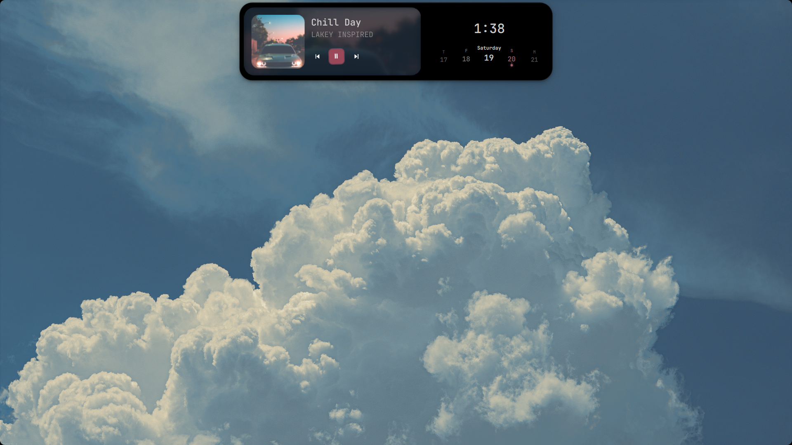
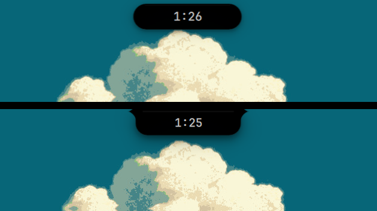
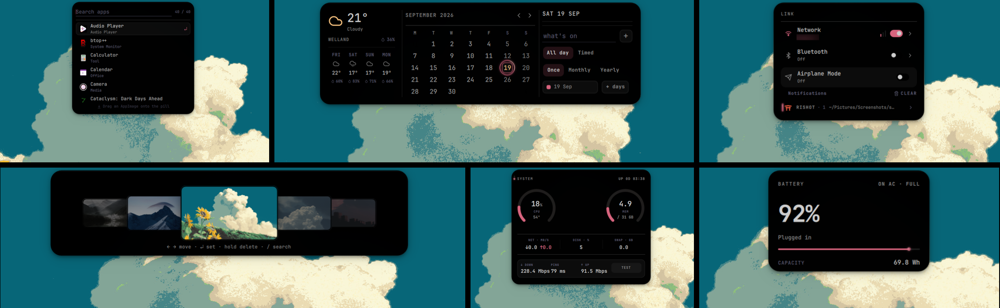

<div align="center">

# Silhouette

**My Hyprland desktop on Fedora 44, and the config behind it. One Quickshell bar
that turns into whatever I need, and as little else as possible.**



</div>

## Why it looks like this

I moved to Linux to get away from bloat. This is the same instinct applied to a
desktop: one pill bar instead of a stack of panels, widgets and applets, and
surfaces that only exist while they are open. Quickshell compiles a surface the
first time you open it and destroys it again once it has been closed for its
idle tier, so nothing sits resident just because you looked at it once. The
resting target is under 200 MB, measured rather than hoped, with
`utils/soak.py` as the routine that keeps it honest.

## What's in the repo

This is my `~/.config`. The parts that matter:

| Tool                           | Description                                                                        |
| ------------------------------ | ---------------------------------------------------------------------------------- |
| `hypr/`                        | Hyprland config: binds, monitors, env, decoration, rules, and scripts.             |
| `quickshell/silhouette-shell/` | Custom Quickshell shell with modules, services, and utilities.                     |
| `nvim/`, `kitty/`, `etc`       | Terminal setup: Kitty, btop, cava, fastfetch, yazi, nvim, tmux, MPD, ncmpcpp, zsh. |
| `install.sh`                   | Installation script.                                                               |

## Where the code comes from

Three things I would rather say plainly than let you find out later.

**The shell is built on Ricelin.**
[Ricelin](https://github.com/Gakuseei/Ricelin) by
[Gakuseei](https://github.com/Gakuseei) is the base this started from. The
pill, the idea of one bar that morphs into whatever surface you need, and the
original shell scaffolding are theirs, and several scripts here began as theirs
too. What is in this repo is that base with a lot of local work on it: reworked
modules, my own settings app and IPC surface, extra surfaces, a different
palette, scripts pulled apart and rebuilt. Credit for the foundation goes to
Gakuseei.

**One piece owes Ukishima.**
[Ukishima](https://github.com/amanhex/ukishima) by
[amanhex](https://github.com/amanhex) is another Quickshell shell sitting on the
same Ricelin base, and the system monitor's ping and network speed test takes
its cue from that shell's version of the card.

**Not everything here is hand-written.** Parts of the shell and the scripts
were written with AI assistance, and several features take code or ideas from
other Quickshell projects, all named in Credits below. Vendored third-party
pieces live in `yazi/flavors/`, `yazi/plugins/` and similar spots. This is a
personal setup that got good enough to live in every day, not a from-scratch
project with purity guarantees.

## The pill

The bar at the top of the screen is the whole shell. Hover it and it grows a
face with the clock, media, tray and minimized apps. Tap it and it becomes:

- media and now playing, with a scrub bar
- a calendar, and a timer
- clipboard history
- an audio and brightness mixer
- a connectivity center: wifi, bluetooth and the notification inbox
- a wallpaper picker with a searchable strip
- an app launcher, a lock screen and a screen recorder
- live machine vitals, and the settings menu behind it

Plus a power menu, an OSD for volume and brightness, a polkit prompt so admin
dialogs land on the pill instead of a bare GTK window, and face unlock on the
lock screen.





## Stack

- WM: Hyprland, configured in Lua
- Shell UI: Quickshell, config in `quickshell/silhouette-shell`
- Terminal: kitty
- Shell: zsh
- Editor: Neovim, config in Lua
- Files: yazi, with flavors
- Music: mpd + ncmpcpp, cava for the bars
- Monitoring: btop, fastfetch
- Font: JetBrainsMono Nerd Font, FiraCode Nerd Font
- GTK: Colloid-Grey-Dark, Papirus-Dark, Bibata-Modern-Ice cursor
- Colors: palette pulled from the wallpaper by `hypr/scripts/wallcolors.py`

## Colors and the wallpaper

`wallcolors.py` reads the current wallpaper, pulls a palette out of it, and
recolors the pill, kitty, window borders and fastfetch in one pass. Shuffling
rolls a transition at random (wave, grow, wipe or fade) so consecutive
wallpapers do not all arrive the same way. There is a static theme instead if
you prefer: a port of [vague.nvim](https://github.com/vague-theme/vague.nvim),
cool, dark, low contrast. The palette mode, wallpaper folder and a manual hue
all live in Settings.

<!-- Screenshot 4: drop screenshots/04-retheme.png (two wallpapers side by side) and uncomment. -->
<!--  -->

## Install

> **Warning**
> The installer has not been tested on any machine yet.
> Read [install.sh](install.sh) before piping it into bash, and keep your own
> backups.

One line, straight through the pipe:

```bash
curl -fsSL https://raw.githubusercontent.com/Triangulation5/.config/main/install.sh | bash
```

What it does: detect the distro, make sure `git` and `python3` exist, take the
repo either from a clone at `~/.local/share/silhouette-install` or from
wherever it is already sitting, install the dependencies, then copy the configs
into `~/.config`. Anything it replaces goes to
`~/.local/state/silhouette-install/backups/<timestamp>` first, and files it has
no opinion about are left alone. My monitor layout is swapped for a portable
default with mine kept beside it as `monitors.lua.example`, and hardcoded
`$HOME` paths are rewritten. Nothing is written until it has printed the plan
and you have agreed to it.

Skip the confirmation and choose what you want:

```bash
curl -fsSL https://raw.githubusercontent.com/Triangulation5/.config/main/install.sh | bash -s -- --quickstart
```
```txt
--quickstart      core defaults, no questions
--full            also install the daily apps (nautilus, firefox, yazi and its helpers, mpd, ncmpcpp, btop)
--no-deps         skip the package step, just deploy the configs
--dry-run         walk the whole flow and change nothing
--yes             assume yes for every prompt
--keep-monitors   deploy my monitor layout as-is instead of the portable default
--dir PATH        clone and deploy somewhere other than the default
--source PATH     deploy from a clone you already have, no fetching
--ref REF         branch or tag to fetch, instead of `main`
--help            the same list, from the script itself
```

Quickshell is the one dependency most distros do not ship in their main repos.
On Fedora: `sudo dnf copr enable errornointernet/quickshell && sudo dnf install
quickshell`. On Arch: `quickshell` or `quickshell-git`. The installer checks
and tells you what is missing rather than guessing. Then start a Hyprland
session, from a display manager or a TTY.

Silhouette shell is a hyprland shell. I would not expect it to work on anything
else.

## Keybinds

| Key                       | Action                                       |
| ------------------------- | -------------------------------------------- |
| `Super + Return`          | terminal                                     |
| `Super + Space`           | app launcher                                 |
| `Super + N`               | connectivity and notifications               |
| `Super + V`               | clipboard history                            |
| `Super + C`               | close window                                 |
| `Super + F`               | toggle floating                              |
| `Super + E`               | file manager                                 |
| `Super + W`               | wallpaper picker                             |
| `Super + B`               | shuffle wallpaper and retheme                |
| `Super + Shift + B`       | recorder                                     |
| `Super + A`               | media                                        |
| `Super + M`               | power menu                                   |
| `Super + T`               | system monitor                               |
| `Super + Shift + I`       | settings                                     |
| `Super + comma`           | settings window                              |
| `Super + I`               | keybind cheat sheet                          |
| `Super + O`               | lock                                         |
| `Print`                   | [rishot](https://github.com/Gakuseei/rishot) |
| `Super + H/J/K/L`         | focus                                        |
| `Super + Shift + H/J/K/L` | move window                                  |
| `Super + 1..0`            | workspaces                                   |

The full list is in `hypr/modules/binds.lua`, and on the pill behind `Super +
I`.

## Notes

Of course these are my personal dotfiles and there are things that are wired to
my machine or my habits and will look strange anywhere else:

- `hypr/modules/monitors.lua` carries my panel's mode and scale. The installer
  writes a portable default instead and keeps mine as `.example`.
- The wallpaper scripts expect a `~/Pictures` collection, `awww` as the
  daemon, and `jq` for the settings handoff.
- The shell's state, cache and wallpaper files were renamed from `ricelin`
  paths to `silhouette` ones. `hypr/scripts/migrate-state.sh` carries an older
  tree over, and `launch.sh` runs it before the shell starts, so a restart is
  the whole upgrade. `quickshell/silhouette-shell/README.md` has the recovery if a
  session comes up empty.
- A few features expect tools that are installed on purpose rather than by
  default: `howdy` for face unlock, `gpu-screen-recorder` for hardware-encoded
  capture, `ddcutil` for external monitor brightness. Missing one degrades that
  feature, not the session.

## Credits

- [Ricelin](https://github.com/Gakuseei/Ricelin) by
  [Gakuseei](https://github.com/Gakuseei) — the shell base, the pill, and the
  original scripts this started from.
- [Ukishima](https://github.com/amanhex/ukishima) by
  [amanhex](https://github.com/amanhex) — the system monitor's ping and network
  speed test was inspired by its version.
- [vague.nvim](https://github.com/vague-theme/vague.nvim) — the static palette
  is a port of it, from the terminal to the yazi flavor.
- [Ambxst](https://github.com/Axenide/Ambxst) by
  [Axenide](https://github.com/Axenide) — the rounded screen corners and
  related decorations.
- [caelestia shell](https://github.com/caelestia-dots/shell) — some of the cava
  audio visualizer ideas.
- [flickowoa's dotfiles](https://github.com/flickowoa/dotfiles) — the flowing
  string music visualizer.
- [howdy](https://github.com/boltgolt/howdy) — face unlock, yet to be implemented.
- [yazi](https://github.com/sxyazi/yazi) flavors and plugins in `yazi/flavors/`
  and `yazi/plugins/` are other people's work, vendored.
- The wallpapers, the lock screen art and the fastfetch art are not mine.

`quickshell/silhouette-shell/CREDITS.md` has the longer version.
